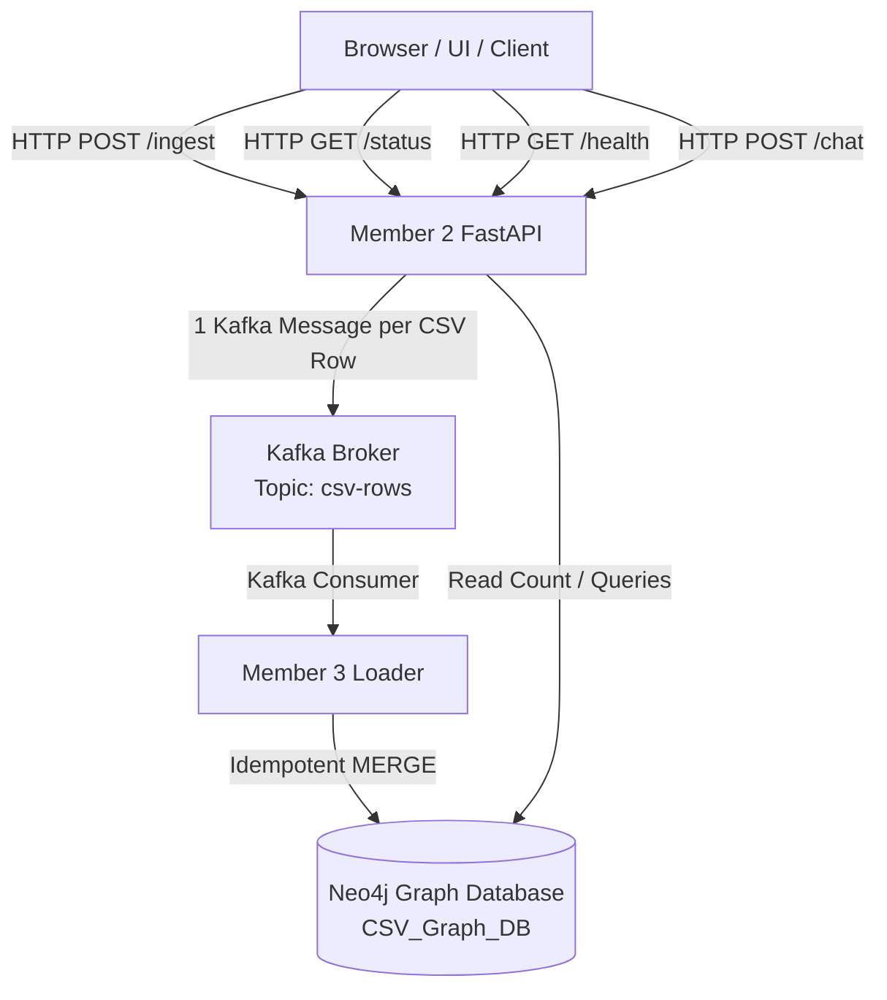

# Member 2 API + Kafka Service ("Data In, Answers Out")

Production-ready backend implementation for **Member 2** of the RISE @ RST #5 Hackathon project: *"Data In, Answers Out"*.

---

## 1. Responsibilities & Scope

- **Member 2 Ownership**: API Gateway, CSV Upload Validation, SHA-256 Dataset ID Generation, Per-Row Kafka Publishing (`csv-rows`), Dependency Health Monitoring, Status Tracking, and Grounded Template-Based Chatbot Queries.
- **Strict Boundary**: **Member 2 DOES NOT directly write CSV rows to Neo4j.** CSV rows flow through Kafka to Member 3's loader, which performs graph insertion via Cypher `MERGE`.

---

## 2. Architecture & Pipeline



---

## 3. Project Structure

```
member2-api-kafka/
├── app/
│   ├── __init__.py      # Package initialization
│   ├── main.py          # FastAPI app & lifespan configuration
│   ├── config.py        # Environment variables & Pydantic settings
│   ├── models.py        # API schemas & request/response models
│   ├── state.py         # In-memory job state manager
│   ├── kafka.py         # Async AIOKafka producer manager
│   ├── neo4j.py         # Async Neo4j database driver manager
│   ├── ingest.py        # POST /ingest endpoint logic
│   ├── status.py        # GET /status endpoint logic
│   └── chat.py          # POST /chat grounded chatbot logic
├── tests/
│   ├── curl-tests.sh    # Executable automated verification script
│   └── postman_collection.json # Complete Postman v2.1 test collection
├── Dockerfile           # Security-hardened pinned Python 3.11 slim image
├── docker-compose.yml   # Kafka KRaft + Neo4j Community + API stack
├── requirements.txt     # Pinned Python package dependencies
├── .env.example         # Reference environment variables
├── sample.csv           # Sample test CSV file
├── MEMBER2_CONTRACT.md  # Contract specification for Member 3 loader integration
└── README.md            # Complete system documentation
```

---

## 4. Tech Stack

- **Python**: 3.11-slim (Pinned Docker base image)
- **Framework**: FastAPI + Uvicorn
- **Kafka Client**: `aiokafka` (Async Kafka producer with `acks="all"`)
- **Neo4j Driver**: Official `neo4j` Python async driver
- **Broker**: Apache Kafka 3.7.0 (KRaft single broker mode)
- **Database**: Neo4j 5.x Community (`CSV_Graph_DB`)
- **Validation**: Pydantic v2 & `python-multipart`

---

## 5. Environment Variables

Create or configure `.env` (defaults provided in `.env.example`):

| Variable | Default Value | Description |
| :--- | :--- | :--- |
| `KAFKA_BOOTSTRAP_SERVERS` | `kafka:9092` | Kafka broker host & port |
| `KAFKA_TOPIC` | `csv-rows` | Kafka topic for CSV rows |
| `KAFKA_CLIENT_ID` | `member2-api` | Kafka client identifier |
| `NEO4J_URI` | `bolt://neo4j:7687` | Neo4j Bolt protocol URI |
| `NEO4J_USER` | `neo4j` | Neo4j auth username |
| `NEO4J_PASSWORD` | `csvgraphdb` | Neo4j auth password |
| `NEO4J_DATABASE` | `CSV_Graph_DB` | Neo4j database instance |
| `MAX_UPLOAD_BYTES` | `52428800` | Max file upload limit (50MB) |

---

## 6. How to Start & Test

### Step 1: Start Services via Docker Compose

```bash
docker compose build
docker compose up -d
```

Check running container status:
```bash
docker compose ps
```

### Step 2: Check System Health

```bash
curl http://localhost:8000/health
```

Expected Response:
```json
{
  "status": "ok",
  "kafka_connected": true,
  "neo4j_connected": true
}
```

### Step 3: Ingest CSV Data

```bash
curl -X POST http://localhost:8000/ingest \
  -F "file=@sample.csv"
```

Expected Response (HTTP 202 Accepted):
```json
{
  "job_id": "b3f1a2c4",
  "rows_received": 3,
  "status": "queued"
}
```

### Step 4: Check Processing Status

```bash
curl "http://localhost:8000/status?job_id=b3f1a2c4"
```

Expected Response:
```json
{
  "job_id": "b3f1a2c4",
  "status": "queued",
  "rows_total": 3,
  "rows_loaded": 0,
  "rows_failed": 0
}
```

*(Status transitions from `queued` -> `loading` -> `complete` as Member 3 consumes rows into Neo4j).*

### Step 5: Chatbot Querying

#### Total Rows Query:
```bash
curl -X POST http://localhost:8000/chat \
  -H "Content-Type: application/json" \
  -d '{"question": "How many rows are there?"}'
```

#### Unsupported Query Fallback:
```bash
curl -X POST http://localhost:8000/chat \
  -H "Content-Type: application/json" \
  -d '{"question": "What is the capital of France?"}'
```

Expected Response:
```json
{
  "answer": "I don't have that in the data.",
  "cypher": "",
  "result": [],
  "grounded": false
}
```

---

## 7. Run Automated Test Suite

Run the provided curl test script:

```bash
./tests/curl-tests.sh
```

---

## 8. Postman Collection

Import `tests/postman_collection.json` into Postman. It includes an automatic post-response test script on `/ingest` that extracts and assigns `jobId` to collection variables.

---

## 9. Deterministic Dataset ID & Idempotency

- `dataset_id` is computed as the first 24 hex characters of the SHA-256 hash of the uploaded CSV bytes:
  $$\text{dataset\_id} = \text{SHA256}(\text{raw\_bytes})[:24]$$
- Re-uploading identical file contents produces an identical `dataset_id`.
- `job_id` is randomized per upload execution (`uuid.uuid4().hex[:8]`).

---

## 10. Known Limitations

- **In-Memory Job State**: Job records are maintained in-memory inside `app/state.py` for a single container instance. Job state will reset if the API container restarts (though Neo4j counts remain persistent).
